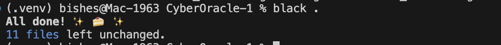

# 🧩 CyberOracle — Week 1 Progress Report
**Contributor:** Bishesh Dulal  
**Role:** Backend / CI-CD / Monitoring  
**Period:** Oct 23 – Oct 28, 2025  

---

## 🎯 Objectives
Initialize FastAPI backend and establish CI/CD linting workflow.

---

## 🧠 Tasks Completed
| Task | Tool / Library | Status |
|------|-----------------|--------|
| Initialized FastAPI structure (`main.py`, `routes/`, `schemas/`) | FastAPI, Pydantic | ✅ |
| Added `/health` endpoint with Pydantic validation | FastAPI | ✅ |
| Created GitHub repo and enabled branch protection | GitHub | ✅ |
| Added linting (flake8 + black) to CI workflow | GitHub Actions | ✅ |
| Configured `.flake8` to exclude `.venv/` and set `max-line-length = 100` | flake8 | ✅ |

---

## 📦 Deliverables
| Deliverable | Description | File / Link |
|--------------|-------------|--------------|
| **FastAPI Skeleton** | Working `/health` route returning validated JSON | [app/main.py](../app/main.py), [app/routes/health.py](../app/routes/health.py) |
| **CI Workflow** | Automated linting + test stages on PRs | [.github/workflows/ci.yml](../.github/workflows/ci.yml) |
| **Flake8 Config** | Lint rules & ignored paths | [.flake8](../.flake8) |

---

## 🧪 Verification & Results
| Check | Result | Screenshot |
|--------|---------|------------|
| Linting (`black --check .`) | ✅ `All done! ✨ 🍰 ✨` |  |
| flake8 Validation | ✅ `no issues found` |  |
| CI Pipeline | ✅ Workflow ran successfully on `main` |  |

---

## 📊 Progress
**Week 1 Progress towards the Project:** 10 %

---

## 🔜 Next Steps
- Develop regex-based DLP middleware  
- Add unit tests and enforce 80 % coverage  
- Integrate coverage reports into CI logs  

---
