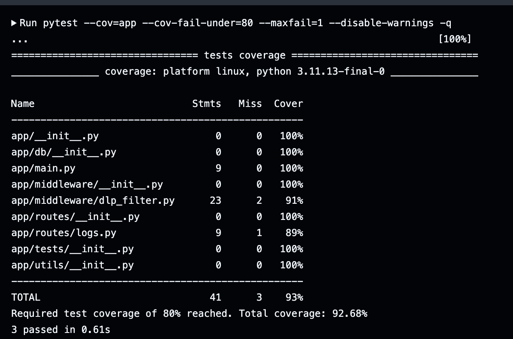
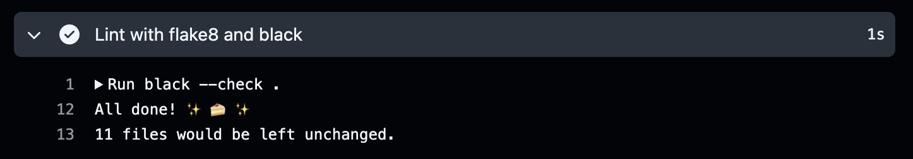

# 🧩 CyberOracle — Week 2 Progress Report
**Contributor:** Bishesh Dulal  
**Role:** Backend / CI-CD / Monitoring  
**Period:** Oct 25 – Oct 30 2025  

---

## 🎯 Objectives
Implement and test regex-based DLP middleware; enforce test coverage ≥ 80 %.

---

## 🧠 Tasks Completed
| Task | Tool / Library | Status |
|------|-----------------|---------|
| Developed regex-based DLP middleware (SSN, Credit Card, Email, API Key) | FastAPI, Python `re` | ✅ |
| Added unit tests with PyTest + coverage enforcement (≥ 80 %) | PyTest, pytest-cov | ✅ |
| Cleaned codebase & resolved lint issues | flake8, black | ✅ |
| Verified CI workflow with automated coverage reports | GitHub Actions | ✅ |

---

## 📦 Deliverables
| Deliverable | Description | File / Link |
|--------------|-------------|--------------|
| **DLP Middleware** | Scans and redacts sensitive data in incoming JSON | [app/middleware/dlp_filter.py](../../app/middleware/dlp_filter.py) |
| **Unit Tests** | Tests for `/health` and DLP filter | [tests/](../../tests/) |
| **CI Workflow (Updated)** | Coverage threshold ≥ 80 % enforced in pipeline | [.github/workflows/ci.yml](../../.github/workflows/ci.yml) |
| **Flake8 Config** | Excludes `.venv/`, sets max line length 100 | [.flake8](../../.flake8) |

---

## 🧪 Verification & Results
| Check | Result | Screenshot |
|--------|---------|-------------|
| PyTest Coverage | ✅ `REQUIRED TEST COVERAGE OF 80 % REACHED` |  |
| Linting (flake8 + black) | ✅ `no issues found` |  |
| CI Pipeline | ✅ Workflow green on push / PR |  |

---

## 📊 Progress
**Week 2 Progress towards the project:** 17 % (total)

---

## 🔜 Next Steps
- Integrate PostgreSQL logging (async inserts)  
- Extend CI/CD to include database integration tests  
- Begin Docker Compose setup for FastAPI + Postgres + Grafana stack  

---
