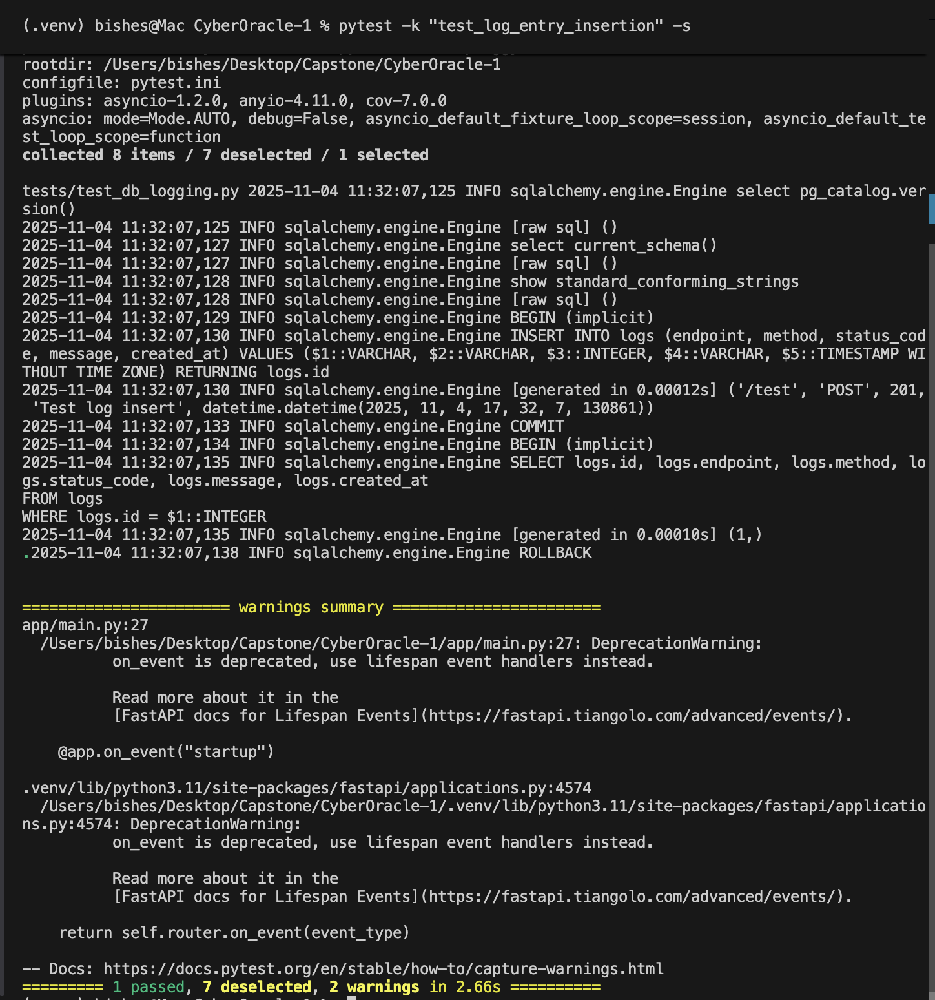
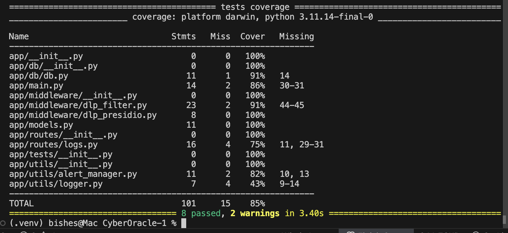
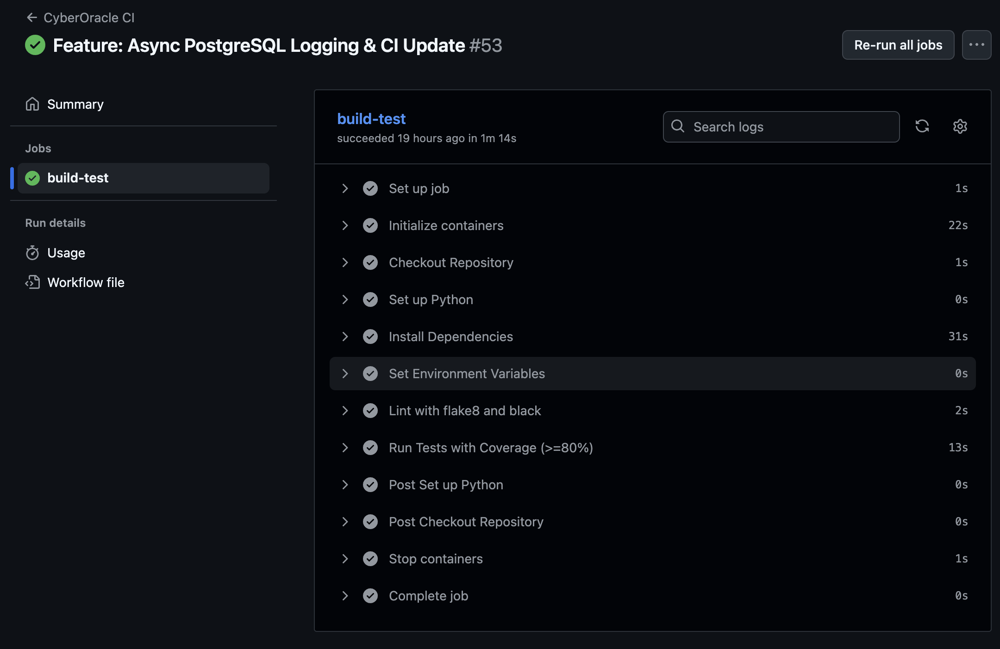

# 🧩 CyberOracle — Week 3 Progress Report
**Contributor:** Bishesh Dulal  
**Role:** Backend / CI-CD / Monitoring  
**Period:** Oct 31 – Nov 4 2025  

---

## 🎯 Objectives
Integrate asynchronous PostgreSQL logging and extend the CI/CD pipeline to validate database operations automatically.

---

## 🧠 Tasks Completed
| Task | Tool / Library | Status |
|------|-----------------|---------|
| Implemented async PostgreSQL logging system (`log_request`) | FastAPI, SQLAlchemy async | ✅ |
| Defined `LogEntry` ORM model and schema | SQLAlchemy, Pydantic | ✅ |
| Added `/logs` API routes for ingestion and verification | FastAPI Router | ✅ |
| Wrote database integration and validation tests | PyTest + pytest-asyncio | ✅ |
| Extended CI/CD to include DB setup + test stages | GitHub Actions (services: Postgres) | ✅ |
| Verified coverage ≥ 80 % and all tests passing | pytest-cov | ✅ |

---

## 📦 Deliverables
| Deliverable | Description | File / Link |
|--------------|-------------|--------------|
| **Async Logging Module** | Inserts log entries into PostgreSQL using `AsyncSessionLocal` | [app/utils/logger.py](../../app/utils/logger.py) |
| **Logs API Router** | Handles log ingestion and validation endpoints | [app/routers/logs.py](../../app/routers/logs.py) |
| **Database Model** | Defines `LogEntry` table structure | [app/models.py](../../app/models.py) |
| **Integration Tests** | Verifies DB inserts + error handling | [tests/test_db_logging.py](../../tests/test_db_logging.py) |
| **CI/CD Update** | Adds PostgreSQL service + async test stage | [.github/workflows/ci.yml](../../.github/workflows/ci.yml) |

---

## 🧪 Verification & Results
| Check | Result | Screenshot |
|--------|---------|-------------|
| Async DB Insert | ✅ `LogEntry successfully inserted and retrieved` |  |
| Test Coverage | ✅ `REQUIRED TEST COVERAGE OF 80 % REACHED` |  |
| CI Pipeline | ✅ All stages passed (GitHub Actions) |  |

---

## 📊 Progress
**Week 3 Progress towards the project:** 27 % (total)

---

## 🔜 Next Steps
- Integrate Grafana dashboard for PostgreSQL metrics  
- Implement structured JSON logs for observability stack  
- Add Docker Compose orchestration for API + Postgres + Grafana  
- Begin threat-model documentation for DLP and logging modules  

---
