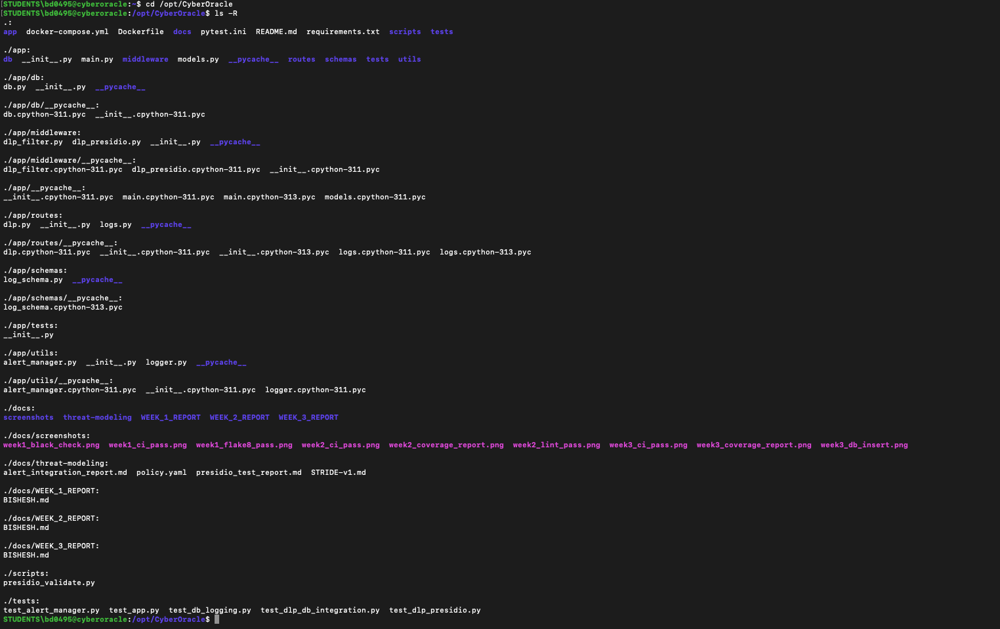
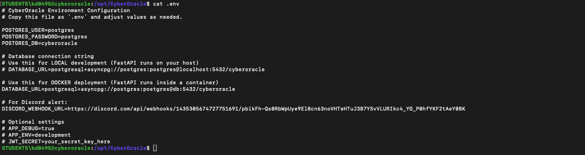
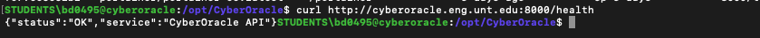
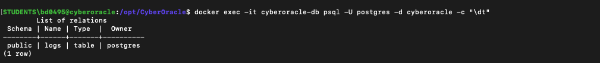
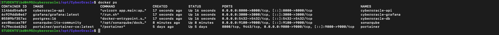
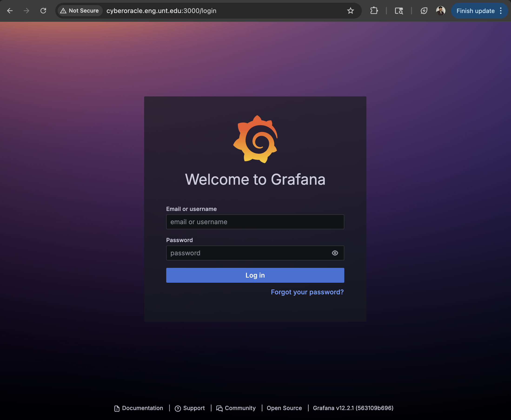
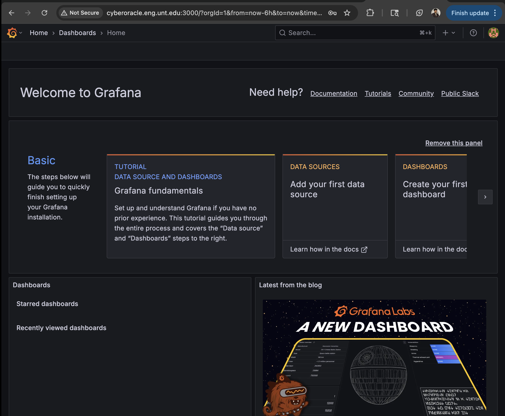

# 🧩 CyberOracle — Week 4 Progress Report  
**Contributor:** Bishesh Dulal  
**Role:** Backend / CI-CD / Monitoring  
**Period:** Nov 18 – Nov 22, 2025  

---

## 🎯 Objectives  
Deploy FastAPI, PostgreSQL, and Grafana using Docker Compose and verify the full stack on the Ubuntu production server.

---

## 🧠 Tasks Completed  

| Task | Tool / Library | Status |
|------|----------------|--------|
| Added **Grafana** service to Docker Compose | Docker Compose | ✅ |
| Updated multi-container backend stack (API + DB + Grafana) | Docker | ✅ |
| Built and deployed latest stack using `docker compose up --build -d` | Docker | ✅ |
| Verified running containers (`api`, `db`, `grafana`, `portainer`) | Docker | ✅ |
| Confirmed `/health` endpoint works on production server | FastAPI | ✅ |
| Verified PostgreSQL `logs` table exists | SQLAlchemy / psql | ✅ |
| Logged into Grafana UI (`:3000`) | Grafana | ✅ |
| Validated complete backend environment on Ubuntu | Docker / Ubuntu | ✅ |

---

## 📦 Deliverables  

| Deliverable | Description |
|-------------|-------------|
| **Updated Docker Compose file** (`docker-compose.yml`) including Grafana |
| **Functional deployment** on `cyberoracle.eng.unt.edu:8000` |
| **Grafana dashboard entry-point** (`:3000/login`) |
| **Database validation** showing `logs` table exists |
| **Screenshots** documenting full system verification |

---

## 🧪 Verification & Results  

### ✔ Project Folder Structure on Server  

### ✔ `.env` Configuration  

### ✔ `/health` Endpoint Operational  

### ✔ PostgreSQL Logs Table  

### ✔ Docker Compose Build Output  

### ✔ Running Containers  

### ✔ Grafana Login Screen  

### ✔ Grafana Dashboard Loaded  

---

## 📊 Progress  
**Week 4 Progress toward the project:** **27% (cumulative)**

---

## 🔜 Next Steps (Week 5–6)  
- Add PostgreSQL as Grafana data source  
- Create metrics dashboard panels:  
  - API request count  
  - Logs over time  
  - DLP blocked events  
  - API uptime  
- Export dashboard JSON for submission  
- Record a short demo of DLP logs visible inside Grafana  

---

## ⭐ Summary  
Week 4 successfully delivered a production-level, containerized environment with FastAPI, PostgreSQL, and Grafana running on an Ubuntu server. This lays the foundation for implementing observability dashboards and monitoring features in Week 5–6.
