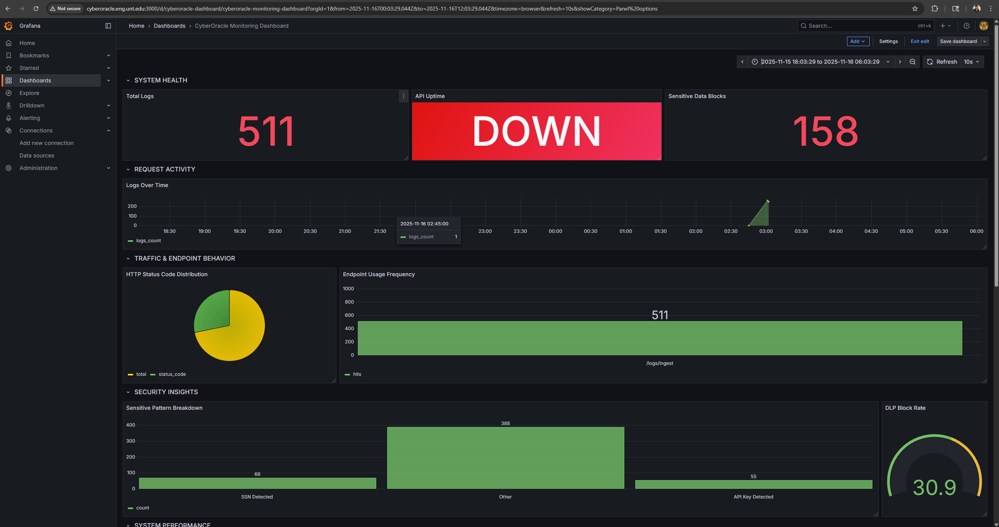
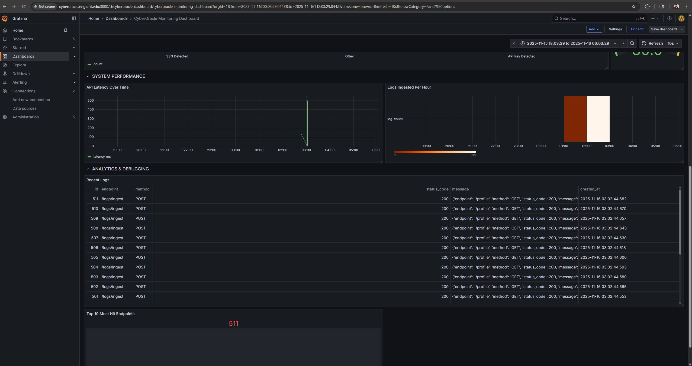

# 🧩 CyberOracle — Week 5–6 Progress Report  
**Contributor:** Bishesh Dulal  
**Role:** Backend / CI-CD / Monitoring  
**Period:** Nov 25 – Dec 6, 2025  

---

## 🎯 Objectives
Develop and deploy the **complete CyberOracle Grafana Monitoring Dashboard** with real-time operational metrics, security insights, and debugging tools.

---

## 🧠 Tasks Completed

| Task | Tools | Status |
|------|-------|--------|
| Added Grafana to Docker Compose stack | Docker, Grafana | ✅ |
| Connected PostgreSQL datasource | Grafana | ✅ |
| Built full CyberOracle Monitoring Dashboard | Grafana | ✅ |
| Created 6 dashboard sections + multiple panels | Grafana | ✅ |
| Generated sample log traffic for testing | FastAPI + curl | ✅ |
| Verified real-time refresh and panel behavior | Grafana | ✅ |
| Added screenshots to project docs | `/docs/screenshots/` | ✅ |

---

## 📦 Deliverables

| Deliverable | Description |
|-------------|-------------|
| **Monitoring Dashboard** | Complete dashboard showing logs, DLP events, uptime, API metrics |
| **Dashboard Sections** | System Health, Request Activity, Traffic Behavior, Security Insights, System Performance, Recent Logs |
| **Screenshots** | Final dashboard screenshots included |
| **Documentation Update** | Week 5–6 progress report added under `docs/WEEK_5_6_REPORT/` |

---

# 📊 Final Dashboard Structure

### **1️⃣ SYSTEM HEALTH**
- Total Logs  
- API Uptime  
- Sensitive Data Blocks  

### **2️⃣ REQUEST ACTIVITY**
- Logs Over Time  

### **3️⃣ TRAFFIC & ENDPOINT BEHAVIOR**
- HTTP Status Code Distribution (Pie)  
- Endpoint Usage Frequency (Bar)  

### **4️⃣ SECURITY INSIGHTS**
- Sensitive Pattern Breakdown  
- DLP Block Rate Gauge  

### **5️⃣ SYSTEM PERFORMANCE**
- API Latency Over Time  
- Logs Ingested Per Hour  

### **6️⃣ ANALYTICS & DEBUGGING**
- Recent Logs Table  
- Top 10 Most Hit Endpoints  

---

# 🖼️ Final Dashboard Screenshots

### **Dashboard — Part 1**

### **Dashboard — Part 2**

---

## 📈 Progress
**Overall Project Progress:** **33%**

---
